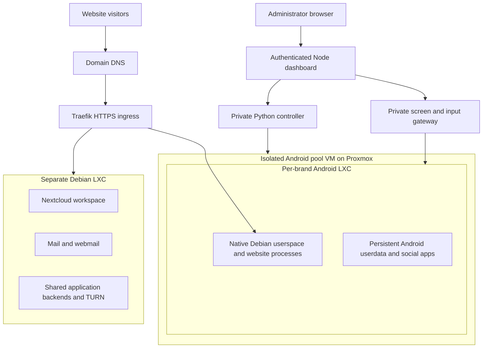

<p align="center">
  
</p>

# BrandFleet by DJ

A control room for website operations, Android devices and shared workspaces. Designed and maintained by **Darshankumar Joshi**.

BrandFleet explores a simple idea: give each brand its own Android environment, run its website in a native Debian userspace inside that environment, and operate both from a browser. A private controller handles lifecycle operations, a bounded screen gateway handles Android input, and shared Debian services provide mail and collaboration.

**Project status:** this repository preserves the Android hosting experiment and its reusable source. The reference deployment was accepted on **6 October 2026** with 15 live devices. The owner has since chosen to move production website hosting back to **Coolify on Debian** because the combined Android runtimes are resource heavy and have application compatibility limits. That return is planned; publishing this repository does not complete it.

[Explore the architecture](docs/architecture.md) · [Run a local preview](docs/local-preview.md) · [Read the operating model](docs/operations.md) · [Upstream projects](THIRD_PARTY.md)

## One brand, one workspace

| Area | What BrandFleet provides |
| --- | --- |
| Websites | Per-brand native Linux processes and persistent data inside an Android LXC environment |
| Android studio | Fixed Instagram, WhatsApp, LinkedIn, X and Figma Mirror launch controls; touch, swipe, text, Home, Back and Recents |
| Fleet control | Authenticated inventory, measured resource limits, lifecycle jobs and backup-aware removal |
| Shared workspace | Nextcloud Files, Talk, Calendar, Contacts and Deck in a separate Debian LXC |
| Mail | Postfix, Dovecot, filtering, quotas, DKIM, webmail and a fixed-mailbox login broker |
| Recovery | Native backup primitives; fresh Android userdata when cloning a website |

### The actual device studio

<p align="center">
  <a href="docs/assets/device-studio.jpg"></a>
</p>

*Reference deployment screenshot, 6 October 2026. Instagram reached its welcome screen through the authenticated browser studio. No connected social account or automated publishing is shown.*

## Architecture



The Android containers share the pool VM's kernel. A container limit isolates its resource budget; it does not create a separate kernel. The pool VM separates Android kernel failures from ingress and shared services, while the physical Proxmox host remains a common dependency.

A [committed SVG version](docs/assets/architecture.svg) makes the diagram available outside Mermaid renderers. [Architecture details](docs/architecture.md) explain the boundaries, admission rules and the planned Coolify destination.

## Try the dashboard locally

The dashboard runs on **Node.js 20 or newer**, using built-in modules and no package dependencies. The local preview reads a generic example inventory and disables lifecycle controls.

```sh
git clone https://github.com/darshjme/Brandfleet-by-DJ.git
cd Brandfleet-by-DJ
node --test brandfleet-dashboard/test/*.test.mjs
```

Follow the [local preview guide](docs/local-preview.md) to create a local password and start the server at `http://127.0.0.1:8170`. Android boot, real mail and host provisioning need an independently configured Linux lab; the preview does not simulate successful device control.

## What was accepted — and what remains open

| Capability | Reference deployment state on 6 October 2026 |
| --- | --- |
| Website continuity | All 15 website origins passed HTTPS acceptance after responsiveness changes |
| Browser interaction | Instagram launch and Android Home input passed actual browser acceptance |
| Viewer optimization | Identical PNGs skip decoding; idle captures back off, and input resets the interval |
| Resource safety | Assigned-memory and measured-available-memory checks gate new devices |
| Shared services | Mail, workspace data and backup/restore checks were accepted within their documented scope |
| Android modernization | Production stayed on Android 14; the Android 16 canary failed bootstrap and was stopped |
| LinkedIn / WhatsApp | LinkedIn usable sign-in remained unresolved; WhatsApp showed a custom-ROM warning |
| Home exit-node routing | Exit-node advertisement existed; approval and Android app egress acceptance remained pending |
| Social publishing | No connected-account or automated-posting acceptance |
| Smooth video | Snapshot control only; smooth streaming and GPU capacity were not accepted |

These are dated observations from the private reference deployment, not a certification of another host. The sanitized public source has its own local test checks. Source backups do not replace data backups, and protocol checks do not establish external mail deliverability.

## Source map

| Directory | Responsibility |
| --- | --- |
| [`brandfleet-dashboard`](brandfleet-dashboard/) | Node HTTP server, browser UI, Android viewer and local tests |
| [`brandfleet-controller`](brandfleet-controller/) | Private API, lifecycle allowlists, inventory and jobs |
| [`android-runtime`](android-runtime/) | Selected provisioning, lifecycle, image, resource and screen-gateway primitives |
| [`brandfleet-native`](brandfleet-native/) | Native Linux userspace process supervision |
| [`brandfleet-services`](brandfleet-services/) | Selected shared mail administration, filtering and backup primitives |
| [`mail-web-login`](mail-web-login/) | Fixed-mailbox webmail grant broker and plugin |
| [`docs`](docs/) | Architecture, operating notes, preview and authentic screenshot |

The source is a configurable reference, not a universal installer. One-off private migrations, runtime inventories, APKs, Android account sessions, databases and credentials are excluded. Host templates and restore paths still require deliberate operator configuration. Tests run locally; no GitHub Actions workflow is provided.

## Design decisions that matter

- Keep administration, controller APIs and ADB behind private boundaries.
- Measure capacity before admitting a device; prepared binder slots do not imply available RAM.
- Back up a website's data independently of its Git repository and Android userdata.
- Clone website content into fresh Android userdata instead of copying signed-in account sessions.
- Provision mail domains explicitly. Website DNS alone does not create email; existing external workspace mail can retain its MX records.
- Separate website hosting from optional Android devices in the planned Coolify return, so website availability no longer depends on an Android runtime.

Built and maintained by **Darshankumar Joshi** · [darshjme](https://github.com/darshjme)

Third-party platforms, software and app names retain their respective ownership and licensing. See [THIRD_PARTY.md](THIRD_PARTY.md).
