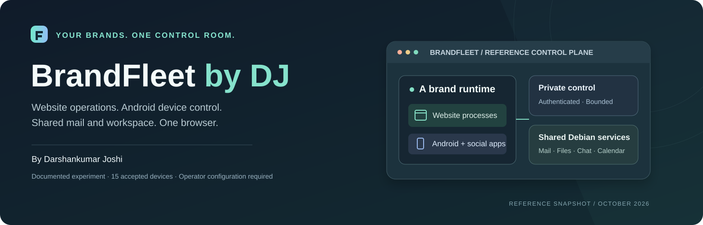
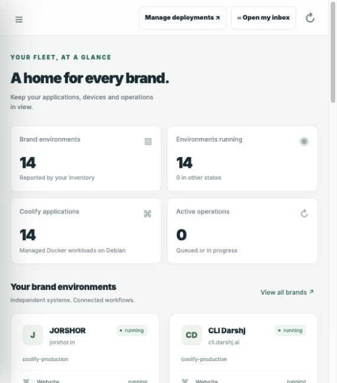
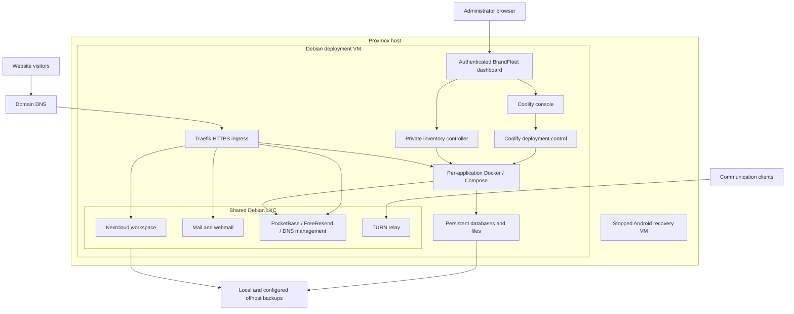
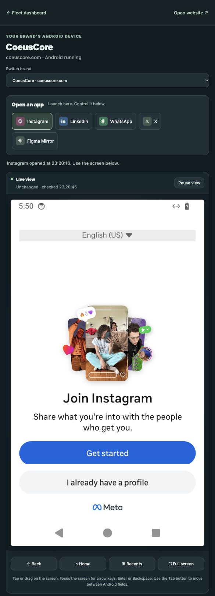

<p align="center">
  
</p>

# BrandFleet by DJ

A browser control room for websites, deployment health, mail and shared workspaces. Designed and maintained by **Darshankumar Joshi**.

Production websites use **Coolify on Debian** with Docker application containers or Compose stacks. Traefik routes each domain to its application; persistent databases, files and scheduled jobs have separate recovery paths. A shared Debian LXC supplies mail, collaboration and common backends. BrandFleet brings their status and management links together.

**Deployment status — 7 October 2026:** all 14 production brands are running on Coolify with current data. After the Android pool stopped, checks passed for all 37 website domains/aliases at the origin and 43 public URLs, including six shared management/service pages, with TLS validation enabled. The stopped Android VM has autostart disabled and its recovery disks retained.

[Explore the architecture](docs/architecture.md) · [Run a local preview](docs/local-preview.md) · [Read the operating model](docs/operations.md) · [Android experiment](docs/android-experiment.md) · [Upstream projects](THIRD_PARTY.md)

## The control room

<p align="center">
  <a href="docs/assets/dashboard.jpg"></a>
</p>

*Actual deployed dashboard, 7 October 2026, after the return to Coolify. Inventory remains available with the Android pool stopped.*

| Area | Deployment model |
| --- | --- |
| Websites | Coolify-managed Docker applications or Compose stacks, with per-service resource limits |
| Routing | Traefik HTTPS ingress selects applications by hostname; many domains share one ingress address |
| Fleet dashboard | Authenticated inventory, live container state, resource observations and deployment links |
| Shared workspace | Nextcloud Files, Talk, Calendar, Contacts and Deck in a separate Debian LXC |
| Mail | Native Postfix, Dovecot, filtering, quotas, DKIM, webmail and a scoped mailbox login broker |
| Shared backends | PocketBase, FreeResend, TURN and DNS management, independent of Android devices |
| Recovery | Current application/configuration backups, data-specific backups and retained Android recovery disks |

BrandFleet is the overview. Coolify owns website deployments. Workspace and webmail keep their own application permissions and authentication boundaries.

## Architecture



Website uptime no longer needs an Android runtime. App containers and Compose services still share the Debian VM's kernel, ingress and physical host. Persistent storage and backups matter as much as container isolation. The [committed SVG](docs/assets/architecture.svg) and [architecture details](docs/architecture.md) describe these boundaries.

## Try the dashboard locally

The dashboard runs on **Node.js 20 or newer**, using built-in modules and no package dependencies. The preview reads a generic example inventory and disables lifecycle controls.

```sh
git clone https://github.com/darshjme/Brandfleet-by-DJ.git
cd Brandfleet-by-DJ
node --test brandfleet-dashboard/test/*.test.mjs
```

Follow the [local preview guide](docs/local-preview.md) to create a local password and start the server at `http://127.0.0.1:8170`. The preview does not connect to production, recreate original databases or simulate successful device control.

## What this repository contains

| Directory | Responsibility |
| --- | --- |
| [`brandfleet-dashboard`](brandfleet-dashboard/) | Node HTTP server, browser UI, deployment links, historical Android viewer and local tests |
| [`brandfleet-controller`](brandfleet-controller/) | Private API, inventory, lifecycle allowlists and jobs |
| [`android-runtime`](android-runtime/) | Preserved Android provisioning, lifecycle, resource and screen-gateway primitives |
| [`brandfleet-native`](brandfleet-native/) | Native Linux userspace process supervision from the experiment |
| [`brandfleet-services`](brandfleet-services/) | Selected shared mail administration, filtering and backup primitives |
| [`mail-web-login`](mail-web-login/) | Fixed-mailbox webmail grant broker and plugin |
| [`docs`](docs/) | Current and historical architecture, operations, preview and authentic screenshots |

This is a configurable reference, not a universal installer or a copy of every hosted website. Private migrations, runtime inventories, app code, APKs, signed-in Android sessions, databases and credentials are excluded. Host integration and restore paths require operator configuration. Tests run locally; no GitHub Actions workflow is provided.

## The Android experiment

The earlier design coupled each website's native Debian userspace to an Android LXC. Fifteen devices passed website origin acceptance on **6 October 2026**. That model had a substantial base resource cost and unresolved social-app compatibility, so production website hosting returned to conventional containers.

<p align="center">
  <a href="docs/assets/device-studio.jpg"></a>
</p>

*Actual browser studio, 6 October 2026. Instagram reached its welcome screen; no connected account or automated posting is shown.*

Production stayed on Android 14. The Android 16 canary failed bootstrap and was stopped. LinkedIn usable sign-in, WhatsApp custom-ROM compatibility, home exit-node app egress and automated posting were not accepted. The [historical architecture](docs/android-experiment.md) keeps the measured scope and source intact. Retained devices are recovery material; restarting them needs independent capacity and compatibility checks.

## Decisions that matter

- Keep website deployments independent of optional Android devices.
- Preserve current writable data before changing routes; prevent two database writers during a cutover.
- Measure actual memory and workload behavior before increasing limits or application count.
- Back up data separately from Git source, and verify recovery at the application's consistency boundary.
- Configure mail domains explicitly. Website DNS alone does not create email; domains already using Google Workspace retain their mail routing.
- Keep private controllers, mailbox issuer material and ADB behind authenticated boundaries.

Built and maintained by **Darshankumar Joshi** · [darshjme](https://github.com/darshjme)

Third-party platforms, software and app names retain their respective ownership and licensing. See [THIRD_PARTY.md](THIRD_PARTY.md).
