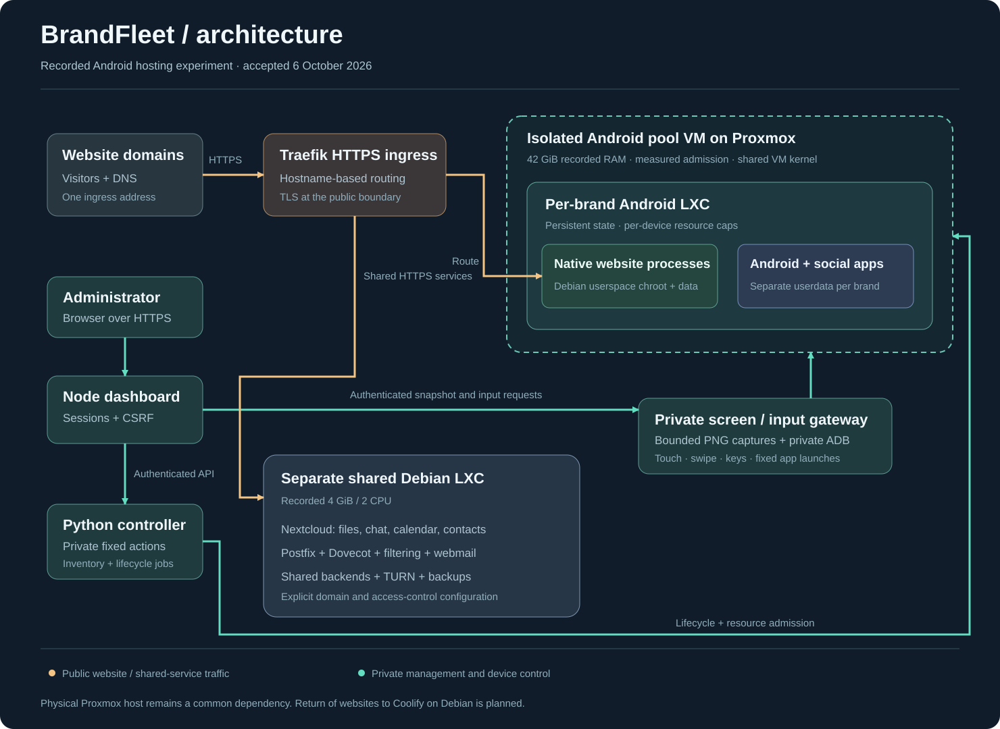

# Coolify on Debian: the current architecture

On **7 October 2026**, all 14 production brands returned to Coolify-managed Docker workloads in the existing Debian VM with current application data. After the Android pool stopped, trusted-TLS checks passed for all 37 website domains/aliases at the origin and 43 public URLs, including six shared pages. Mail, workspace and common backends remain in a shared Debian LXC within that VM. The Android recovery VM is stopped, with autostart disabled and recovery disks retained.

## Domain routing and deployment

Public website traffic reaches Traefik over HTTPS. Traefik chooses an application route by hostname, so multiple domains and aliases can share one ingress address. DNS points traffic to the ingress; Coolify and the reverse proxy determine which application serves it.

Small sites run as individual Docker application containers. Stateful applications run as Compose services with the web application, database and other dependencies represented separately. Coolify manages the deployment resource; application code, runtime configuration, writable storage and scheduled jobs still need deliberate ownership.

Container resource limits constrain a service's usage. They do not supply an independent kernel, eliminate dependencies on ingress or prevent all failures elsewhere in the VM. A stopped or unhealthy application should affect its own route; the shared Debian VM, storage and physical Proxmox host remain common dependencies.

## What the dashboard controls

The authenticated Node dashboard presents brands, website status, container resources, shared-service links and the relevant Coolify deployment page. Its private Python controller maps each brand to the current managed resource and actual containers. Stopped historical deployments do not replace a healthy current instance in inventory.

Coolify owns deployment changes. BrandFleet provides their overview and direct management navigation. A dashboard session does not grant unrestricted access to every mailbox or shared workspace. These applications retain their own authentication and access controls.

Android lifecycle and creation controls remain blocked. The completed return uses a retained inventory snapshot rather than repeatedly contacting the stopped recovery VM. The historical screen/input gateway and provisioning source remain available for an independently qualified Android lab.

## Shared services

| Component | Responsibility |
| --- | --- |
| Nextcloud | Files, Talk, Calendar, Contacts and Deck |
| Postfix / Dovecot | SMTP transport, mailboxes and IMAP access |
| Filtering and DKIM | Spam/virus filtering, signing, quotas and mailbox rules |
| Webmail and login broker | Webmail plus a short-lived, single-use grant for a configured mailbox |
| PocketBase | Shared application backend |
| FreeResend | Shared email-sending application service |
| TURN | Relay service for communication clients |
| DNS management | Optional management interface; no separate Android device is required |

These services run natively in the shared Debian LXC. Its bridge, DHCP and required service endpoints remain active even when the Android pool is stopped. Applications that depend on PocketBase, mail or FreeResend use the current shared-service endpoints rather than old Android compatibility aliases.

Serving multiple domains does not automatically create isolated organizations. Nextcloud groups, memberships and sharing permissions define collaboration boundaries. Mail domains and mailbox grants also require explicit administration. Two reference-deployment domains already use Google Workspace; their Google mail routing is retained independently of website hosting.

## Persistence and recovery

The return carries forward current application code, private runtime configuration and current writable data. Old retained Docker data is not presumed current. Database writers are stopped or otherwise quiesced before consistent transfer; routes change after candidate acceptance. Old Android writers stay stopped to avoid two active copies.

Different data needs different checks: file parity for static assets and configuration, database counts and extensions, integrity checks for SQLite, and restart persistence for managed services. Job schedules must target the accepted containers and endpoints. A copy of source on GitHub does not preserve mailboxes, database writes or social sessions.

Current local backups, verified offhost backups where configured, original data directories and Android recovery disks serve separate purposes. The restored trading website has a successful local backup; its offhost target remains unconfigured. Migration cold restores were verified, but an isolated restore drill of the new nightly logical archives remains unrun. Archive validation is not an isolated restore test. Some large historical datasets were checked by metadata, counts and headers rather than a full-file checksum scan; the private operational evidence records those bounds.

## Resource policy

Measure available memory and workload behavior on the actual host. Per-container limits, idle observations and VM RAM allocations describe different things: reducing a container limit does not prove that amount of physical RAM has been reclaimed. Stopping the Android recovery VM is the relevant boundary for releasing its guest allocation to Proxmox.

On 7 October 2026, host available memory measured **4.62 GiB at 07:21:59 UTC** and **46.13 GiB at 08:23:49 UTC**, after the recovery VM was confirmed stopped. The **41.51 GiB increase over that interval** includes any other workload variation; it is a dated observation, not a peak-load benchmark or a promise of future free memory.

The return preserves Kali's configuration and runtime. Website serving, shared-service health, database continuity, route acceptance and scheduled maintenance are checked before ending the migration. Trading automation remains paused independently of the restored trading website; restoring a UI does not authorize automated trades.

## Historical Android model

The [Android experiment](android-experiment.md) coupled native Debian website processes with per-brand Android LXC devices in an isolated pool VM. It remains source and recovery reference. Android app installation never established connected-account posting, usable sign-in for every app, home-IP egress or undetectable automation. The current website architecture removes that runtime from website uptime.
